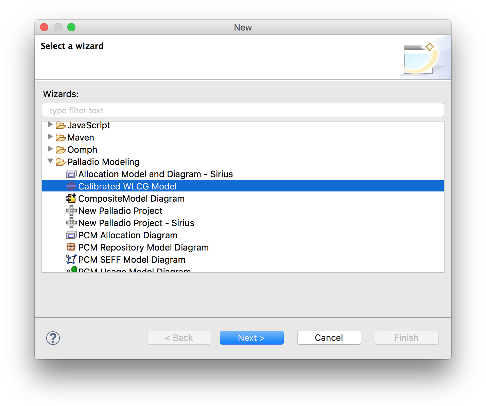
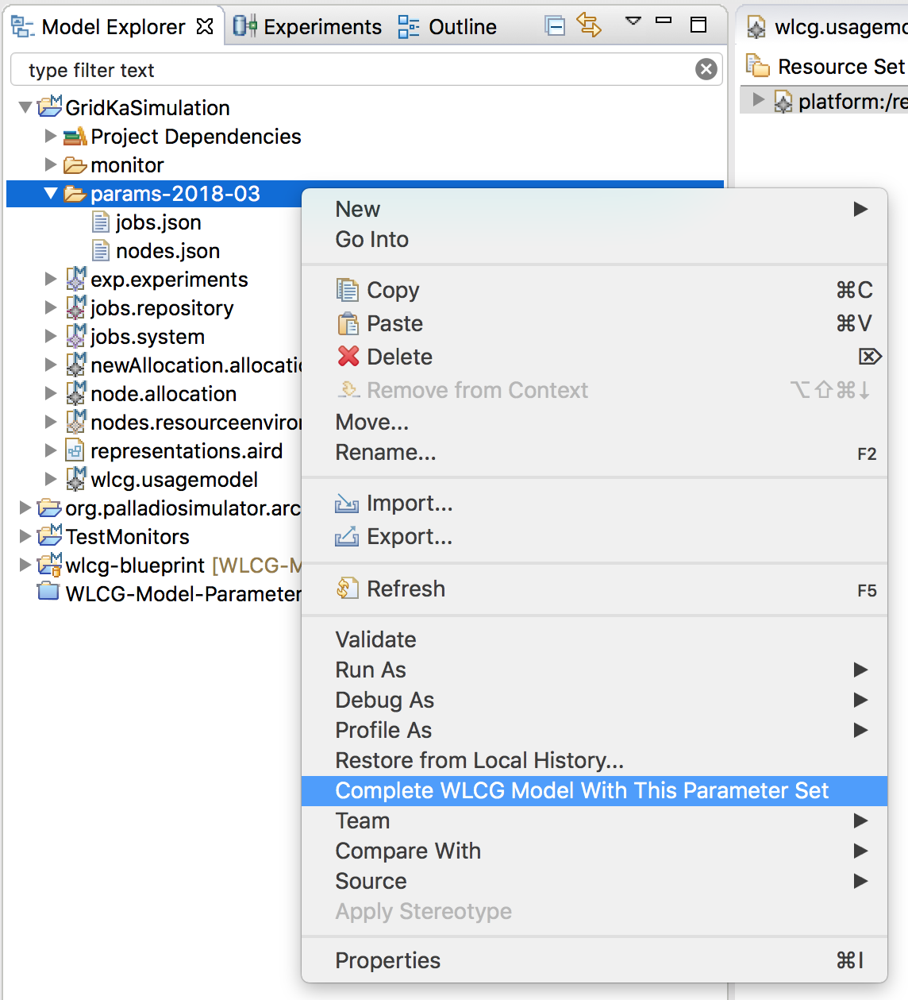

# WLCG Model Construction

This Eclipse plugin allows to construct Palladio simulation models for a site of the Worldwide LHC Computing Grid. Models are constructed using

- a blueprint Palladio simulation model (included in the plugin) and
- JSON parameter description files.

## Installation and Requirements

- This plugin requires a running Palladio installation.
    - Eclipse Neon or Oxygen
    - Eclipse Modeling Tools
    - PCM Tools including SimuLizar and Architectual Templates. Detailed installation documentation can be found in the [Palladio Developer Wiki](https://sdqweb.ipd.kit.edu/wiki/PCM_Installation).
    - Installing Palladio from the [nightly update site](https://sdqweb.ipd.kit.edu/eclipse/palladiosimulator/nightly/) is recommended as this makes sure that all required Palladio components are up to date and include the required dependencies.

- The [Loadbalacing Addon for the Palladio Architectural Templates](https://github.com/PalladioSimulator/Palladio-Addon-ArchitecturalTemplates-LoadBalancing) is required.

- The plugin uses Gson to parse JSON files. This dependency is already included in the plugin and does not need to be installed separately.

- Currently, the plugin is not available to be installable via an update site, but only as this project. To use it, follow these steps:
    1. Import the project into an Eclipse workspace of your choice. Make sure it is opened.
    2. Start a runtime Eclipse application with the plugin loaded (e.g. by right-clicking the project and choosing `Run As` – `Eclipse Application` from the context menu).

## Notes

- WLCG model files can be created in any Palladio modeling project. Be aware that in case of conflicts, the plugin will *overwrite* conflicting model files. In this case, the plugin will also ask you to confirm overwriting existing models.
- To create a WLCG model, [JSON parameter description files](#input-files) are needed
    - Place them in any directory in your modeling project
    - The files are expected to be named `nodes.json` and `jobs.json`

## Usage

Models can be constructed from the blueprint model with this plugin in two ways:

- A new modeling project can be created using a custom new project wizard included in the plugin.

  Using this method, models are always created with the sample calibration data included in the plugin itself.
  
  To create a new project, follow these steps:
    1. In the menu bar, select `File` – `New` – `Other...`
    2. In the popup, under `Palladio Modeling`, select `Calibrated WLCG Model`
    3. Select a name and location for the project and click `Finish`.

- Models can also be constructed inside of an already existing project:
    1. Put your parameter description files into any directory inside of your project. Make sure they have the right names and structure as described [here](#input-files).
    2. Right-click on the directory containing your parameter description files in the **Model Explorer**, **Package Explorer** or **Project Explorer** view. Make sure to directly select the containing directory. 
    3. Click `Complete WLCG Model with this parameter set` in the context menu
    4. Confirm that you want to overwrite conflicting model files.
    5. A dialog will indicate completion of the model construction or show an error if it failed.

## [Input Files](#input-files)

The input files required for creating a simulation model are expected to be named `nodes.json` and `jobs.json`. Their structure is described in more detail [here](docs/calibration-parameter-files.md).

## Architecture Overview

An overview over the architecture of the plugin can be found in [a separate document](docs/architecture-overview.md).
